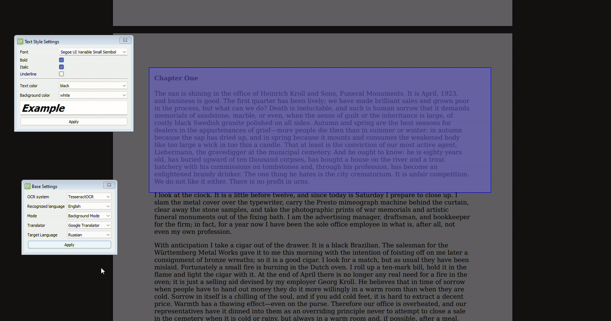

# Screen Translator

It is a screen translation app with an intuitive interface that acts as an overlay with a touch of transparency. Written in PyQt5, it provides users with a powerful tool to translate text in real time right on the screen.

## Key Features

* **Interface Overlay:** A transparent interface allows users to interact with the application without obscuring the main content of the screen.
* **Hotkeys:** You can show or hide the interface using hotkeys (Ctrl + Alt).
* **OCR systems:** The application uses two OCR systems: Tesseract and EasyOCR, which ensures accurate text recognition.
* **Settings:** The interface provides users with many settings, such as selecting the OCR system, recognized language, translation language, system for inserting translated text, and font settings.
* **Easy to use:** Simply select an area of the screen with text or subtitles, and the application will automatically recognize and translate the text, maintaining its original position.

## How it works

1. The user selects an area of the screen with text or subtitles in the overlay interface.
2. The interface is hidden and the user selects an application (windowed only) by clicking on it with the mouse.
3. Using the coordinates of the selected area, an image of the application is captured.
4. The image is sent for preprocessing (if required) for subsequent submission to the OCR system.
5. The recognized text is grouped into lines and translated.
6. Translated strings are displayed in the same places where the original strings were.
7. Using computer vision methods, an image is created that overlaps the text.

## Installation

1. Download or clone the repository.
2. Install the required packages using `pip install -r requirements.txt`.
3. Make sure Tesseract OCR is installed.
4. In the `config.py` file you need to set the path to the installed Tesseract. The path will look something like this: `C:\Users\USER_NAME\AppData\Local\Programs\Tesseract-OCR\tesseract.exe`.
5. Download the following files from [https://github.com/tesseract-ocr/tessdata](https://github.com/tesseract-ocr/tessdata):
   - `rus.traineddata`
   - `eng.traineddata`
   - `kor.traineddata`
   - `jpn.traineddata`
   - `chi_sim.traineddata`
   - `chi_tra.traineddata`
6. Place the downloaded files in the tessdata folder in the Tesseract directory.
7. Run main.py.

Note: The application requires an active Internet connection to translate text.

## Project status

The project is in the early stages of development and requires optimization and bug fixes. Many features do not perform well and further testing and performance improvements are required.

## Known Issues

Here are some known issues and plans for future development:

1. **~~Ineffective translation work.~~**
2. **~~Poor implementation of composing rows from detected text~~**
3. **There are many false positives when running Tesseract.**

> **Potential Solution:**
> Add a more accurate model for text detection and limitation.

4. **Incorrect definition of height for rows with text.**

> **Potential Solutions:**
> Divide text into blocks, and set the same size (mean or median) for blocks.

5. **Translated text does not fit within the selection frame.**

> **Potential Solution:**
> Reduce the width of characters and the space between them in lines that do not fit

6. **~~Only Google Translate works.~~**
7. **Only Google Translate works well.** Despite the fact that there are 2 other translation systems, it is highly recommended to use only Google. Others are a little slower and currently have trouble getting the text to fit correctly.
8. **Poor error handling. But even so everything works (probably).**

This is the first thing that came to mind. In addition to the above issues, there are others, for example, potentially poor use of PyQt5, perhaps not the most successful project architecture, lack of logging, etc. I will gradually correct the issues listed above and add new functionality. I will also try to add other OCR systems (for example, [PaddleOCR](https://github.com/PaddlePaddle/PaddleOCR)) or combinations of those already in use. Maybe I’ll train the model for recognition in EasyOCR for non-standard fonts
